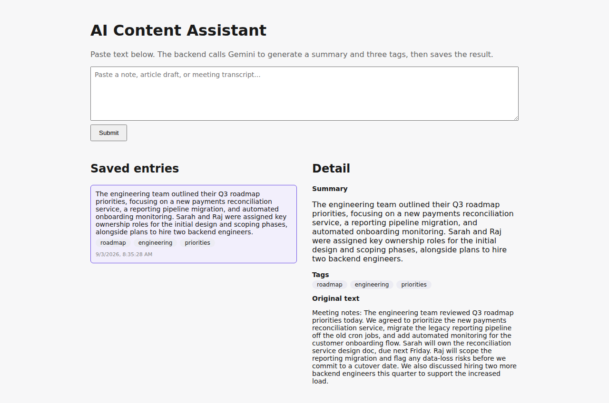

# AI Content Assistant

A small full-stack prototype (IIFL Finance Full Stack Developer — Round 1 Assignment). A user pastes a block of
text; the backend calls Gemini to generate a concise summary and exactly three tags; the result is persisted in
SQLite and shown in a list/detail UI.

**Stack:** React (Vite) · FastAPI (Python) · Gemini API · SQLite

## Screenshot



_(Add `screenshot.png` here showing a submitted entry with its generated summary and tags before submitting.)_

## Setup

### Backend

```bash
cd backend
python -m venv .venv
.venv\Scripts\activate        # Windows (use `source .venv/bin/activate` on macOS/Linux)
pip install -r requirements.txt
copy .env.example .env        # Windows (use `cp .env.example .env` on macOS/Linux)
# then edit .env and set GEMINI_API_KEY to your own key (https://aistudio.google.com/apikey)
uvicorn main:app --reload
```

Backend runs at `http://localhost:8000`.

### Frontend

```bash
cd frontend
npm install
copy .env.example .env        # optional — defaults to http://localhost:8000 already
npm run dev
```

Frontend runs at `http://localhost:5173`.

### Tests

```bash
cd backend
pytest -q
```

Tests mock the Gemini call, so they run offline and don't consume API quota.

## API

- `POST /entries` — `{"text": "..."}` → generates summary + 3 tags via Gemini, persists, returns the entry (201).
  Returns 502 with a `detail` message if the AI call fails.
- `GET /entries` — list saved entries, newest first.
- `GET /entries/{id}` — a single entry, 404 if missing.

## README questions

**1. Architecture.** The React frontend calls `POST /entries` on the FastAPI backend with the raw text. FastAPI
validates it (non-empty, ≤8000 chars), calls the Gemini REST API with a prompt + a JSON response schema, and
validates the parsed `{summary, tags}` shape. On success it writes a row to SQLite and returns it; the frontend
adds it to the list and can select it for the detail view. `GET /entries` and `GET /entries/{id}` read straight
from SQLite.

**2. AI choice.** Google Gemini (`gemini-3.5-flash-lite`), called directly via the REST API with `requests`
(no SDK). It's fast and inexpensive for a short summarization + tagging task, and its structured-output mode
(`responseSchema`) lets us constrain the JSON shape directly instead of hoping the model behaves.

**3. Reliability.** The Gemini call has a 15s timeout. If it times out, errors, returns non-JSON text, or returns
JSON missing a summary or with anything other than exactly 3 tags, the backend raises a typed `AIServiceError`
and the API responds `502` with a readable message — nothing is written to the database. The frontend surfaces
that message inline instead of crashing.

**4. Privacy.** Only the submitted text is sent to Gemini (in the prompt), plus the API key as a query parameter
over HTTPS. In a financial-services setting we'd avoid sending anything containing account numbers, PII, or
other regulated customer data unless the provider has a signed data-processing/BAA-equivalent agreement and the
text is scrubbed/redacted first; today this prototype has no redaction step.

**5. Production next steps.**
- Redact/mask PII before the prompt is sent, and add per-user auth + rate limiting on `POST /entries`.
- Move off "open a SQLite connection per request" to a pooled Postgres setup, and add retries/backoff (not just
  a single timeout) around the Gemini call.
- Add structured logging/tracing around the AI call (latency, failure rate) for observability.

**6. AI coding tools.** Built with Claude Code (Anthropic), which scaffolded and wrote the backend, frontend,
and tests from a short plan. Output was validated by running the actual test suite (`pytest`), running both dev
servers and exercising the real HTTP endpoints with `curl`/the browser, and reading through each generated file
for correctness before accepting it.
